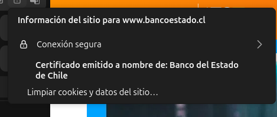

# Trabajo de investigación

1. ## Diferencia entre HTTP y HTTPS
    1. ### Qué significa HTTP y HTTPS
    | Protocolo | Significado | Descripción |
    |-----------|-------------|------------ |
    | HTTP | HyperText Transfer Protocol | Es el protocolo que permite la comunicación entre un navegador (cliente) y un servidor web. Envía y recibe información como texto, imágenes, videos, etc., pero sin cifrar. |
    | HTTPS | HyperText Transfer Protocol Secure | Es la versión segura de HTTP. Utiliza un cifrado mediante SSL/TLS para proteger la comunicación entre el cliente y el servidor.

    **Resumen**:
    - HTTP: los datos viajan "en texto plano".
    - HTTPS: los datos viajan "cifrados" para evitar espionaje o manipulación.

    2. ### Cómo funciona el cifrado SSL/TLS en HTTPS

    🔒 SSL (Secure Sockets Layer) y su versión más moderna TLS (Transport Layer Security) son protocolos de seguridad que cifran la información.

    🔐 Funcionamiento paso a paso:

    1. Conexión inicial:
    El navegador solicita una conexión segura con el servidor (https://).

    2. Envío del certificado:
    El servidor envía su certificado digital SSL/TLS, emitido por una autoridad certificadora (CA), para demostrar su identidad.

    3. Verificación:
    El navegador verifica que el certificado sea válido y emitido por una entidad confiable.

    4. Intercambio de claves:
    Se genera una clave de sesión cifrada mediante criptografía asimétrica (clave pública y privada).

    5. Comunicación segura:
    A partir de ahí, todos los datos viajan cifrados mediante criptografía simétrica (más rápida), usando la clave de sesión

    **Ejemplo**:
    Cuando ingresas tus datos de tarjeta o contraseña en una web con HTTPS, esos datos se transforman en una secuencia cifrada que nadie puede leer si la intercepta.

    3. ### Por qué https es más seguro?
    |Ventaja|Descripción|
    |-------|-----------|
    |**Cifrado**|Protege la información durante la transmisión (nadie puede leerla).|
    |**Integridad**|Evita que los datos sean modificados o manipulador en el camino.|
    |**Autenticación**| Verifica que estás comunicándote con el sitio correcto (no con uno falso).|

    Por ejemplo, si se visita el sitio https://bancoestado.cl, el candado indica que estás realmente conectado al banco no a un sitio fraudulento.

    4. ### Ejemplo visual
    

    5. ### ¿Que sucece si un sitio no usa HTTPS?
    - Los datos pueden ser interceptados (por ejemplo, contraseñas o información bancaria).
    - Alguien podría modificar el contenido del sitio durante la transmisión.
    - Los navegadores muestran advertencias, como "Sitio no seguro".
    - Los motores de búsquedad penalizan a los sitios sin HTTPS, afectando su posicionamiento.

2. ## Puertos de comunicación
    1. ### Qué es un puerto en redes?
    Un puerto es un número lógico que permite que un dispositivo (como un computador o servidor) identifique qué tipo de servicio o aplicación debe recibir los datos que llegan por la red.  
    Los puertos val del 0 al 65535, y se dividen en tres categorías:
    - Puertos bien conocidos (0-1023): reservados para servicios estándar (HTTP, FTP, SSG, etc).
    - Puertos registrados (1024-49151): para aplicaciones específicas o personalizada.
    - Puertos dinámicos o privados (49152-65535): para conexiones temporales.

    2. ¿Por qué es importante para HTTP?
    El protocolo HTTP necesita un puerto para escuchar y aceptar conexiones de los clientes (navegadores).
    - Cuando escribes una dirección como http://example.com, el navegador sabe que debe conectarse por el puerto 80 (por defecto).
    - Si fuera https://example.com, usa el puerto 443.  
    Esto permite que el servidor reciba las solicitudes HTTP/HTTPS y las envíe al servicio web correcto (por ejemplo, Apache o Nginx).
    3. ### Puertos 80 y 8080
    |Puerto|Protocolo|Uso principal|Descripción|
    |-|-|-|-|
    |80|HTTP|Tráfico web sin cifrar|Es el puerto predeterminado para HTTP. No utiliza cifrado SSL/TLS.|
    |8080|HTTP alternativo|Tráfico web de pruebas o desarrollo|Usado comúnmente por servidores de desarrollo o aplicaciones web secundarias cuando el puerto 80 ya está en uso.|

    🧠 **Ejemplo práctico**:

    - http://localhost:80 es igual a http://localhost (el navegador asume el puerto 80).

    - http://localhost:8080 se usa típicamente en entornos de desarrollo como Tomcat, Spring Boot, o Node.js

    4. ### Otros puertos conocidos y su función
    | Puerto | Protocolo | Servicio o Aplicación|Descripción |
    | - | - | - | - |
    | 21 | FTP | File Transfer Protocol | Transfiere archivos entre computadoras. |
    |22| SSH|Secure Shell|Permite acceso remoto seguro a otros equipos.|
    |25|SMTP|Simple Mail Transfer Protocol|Envía correos electrónicos.|
    |53|DNS|Domain Name System|Traduce nombres de dominio (como google.com) a direcciones IP.|
    |80|HTTP|Web sin cifrar|Tráfico web básico.|
    |110|POP3|Post Office Protocol|Descarga correos electrónicos del servidor.|
    143|IMAP|Internet Message Access Protocol|Permite leer correos directamente en el servidor.|
    |443|HTTPS|Web cifrada|Comunicación segura mediante SSL/TLS.|
    |3306|MySQL|Base de datos|Conexiones de bases de datos MySQL.|
    |3389|RDP|Remote Desktop Protocol|Conexión a escritorio remoto (Windows).|

    5. ### ¿Qué puerto utiliza HTTPS por defecto?
    HTTPS utiliza el puerto 443 por defecto.

3. ## Códigos de estado de respuesta HTTP
    **200 OK**

    - Significado: Todo salió bien.

    - Cuándo aparece: El servidor procesó la solicitud correctamente y devolvió la respuesta esperada.

    - Ejemplo: Cuando una API devuelve correctamente los datos solicitados (GET /users → lista de usuarios).

    - Uso práctico: Sirve para confirmar que una función, endpoint o página web está operando correctamente.  

    En un proyecto web:
    Si haces una petición con fetch() o axios y recibes un 200, sabes que tu backend respondió sin errores.

    **404 Not Found**

    - Significado: El recurso solicitado no existe o fue movido.

    - Cuándo aparece:

        - La URL está mal escrita.

        - El archivo fue eliminado o cambiado de lugar.

        - En APIs, el endpoint no existe o la ID consultada no está en la base de datos.

    - Ejemplo:  
    GET /usuarios/999 → el usuario con ID 999 no existe.

    - Uso práctico:  
    Te permite diagnosticar rutas mal configuradas, errores de escritura en URLs o recursos inexistentes.

    📘 En un proyecto web:
    Si haces clic en un enlace y ves un 404, revisas:

    - si el endpoint existe,

    - si la ruta en el frontend coincide con la del backend,

    - o si el archivo fue eliminado del servidor.

    **500 Internal Server Error**

    - Significado: Hay un problema dentro del servidor (backend).

    - Causa común:

        - Errores de programación (excepciones no controladas).

        - Fallos en la conexión a la base de datos.

        - Configuraciones incorrectas en el servidor o framework.

    - Ejemplo:  
    Un error en Django, Flask o Node.js que no se capturó correctamente.

    Uso práctico:  
    Indica que la solicitud del cliente era válida, pero el servidor no pudo procesarla por un fallo interno.

    📘 En un proyecto web:  
    Si tu API responde con 500, revisas los logs del servidor o la consola del backend para identificar la causa exacta del error.

    **Status codes**
    |Escenario|Código esperado|Qué indica|Acción del desarrollador|
    |-|-|-|-|
    |Solicitud correcta a un endpoint existente|200 OK| Todo funciona bien|No se requiere acción.|
    |Solicitud a un recurso inexistente|404 Not Found|URL o ID inválida|Revisar rutas, endpoints y nombres de archivos.|
    |Error en el servidor al procesar datos|500 Internal Server Error|Problema de backend|Revisar logs, excepciones y bases de datos.|
    |Petición con formato incorrecto|400 Bad Request|Error del cliente|Validar los datos enviados.|
    |Falta de autenticación|401 Unauthorized / 403 Forbidden|Acceso restringido|Verificar token o permisos.|

4. ## Métodos HTTP
    Los métodos HTTP (o HTTP verbs) son acciones que indican qué desea hacer el cliente con un recurso en el servidor.  
    En las APIs RESTful, cada método tiene un propósito específico:
    - Leer
    - Crear
    - Actualizar
    - Eliminar  

    |Método|Acción|Operación típica| Descripcion|
    |-|-|-|-|
    |GET|Consultar|📖 Leer datos|Solicita información de un recurso sin modificarlo.|
    |POST|Crear|🆕 Crear datos|Envía datos al servidor para crear un nuevo recurso.|
    |PUT|Actualizar|✏️ Reemplazar datos|Actualiza un recurso completo existente.|
    |DELETE|Eliminar|🗑️ Borrar datos|Elimina un recurso del servidor.|

    ### Ejemplos prácticos
    GET – Consultar información
    Qué hace:
    Obtiene datos del servidor (no los modifica).
    Uso típico: Consultar listas o detalles de recursos.
    ```bash
    GET /api/usuarios
    ```
    Respuesta (ejemplo JSON):
    ```json
    [
        { "id": 1, "nombre": "Jonathan" },
        { "id": 2, "nombre": "Camila" }
    ]
    ```
    En Python (requests):
    ```python
    response = requests.get("https://miapi.com/usuarios")
    print(response.json())
    ```
    POST – Crear un nuevo recurso

    Qué hace:
    Envía información al servidor para crear algo nuevo.
    Uso típico: Registrar usuarios, crear pedidos, subir datos.
    ```bash
    POST /api/usuarios
    ```
    Cuerpo (JSON enviado):
    ```json
    [
        { "nombre": "Jonathan" },
        { "correo": "jonthan@example.com" }
    ]
    ```
    Respuesta(servidor):
    ```json
    {
        "id": 3,
        "mensaje": "Usuario creado correctamente"
    }   
    ```
    En python (requests):
    ```python
    requests.post("https://miapi.com/usuarios", json={"nombre": "Jonathan", "correo": "jonathan@example.com"})
    ```
    PUT  
    Qué hace:
    Reemplaza todo el recurso con nuevos datos.
    Uso típico: Actualizar por completo un registro (como un perfil de usuario).
    ```bash
    PUT /api/usuarios/3
    ```
    Cuerpo (JSON):
    ```json
    {
        "nombre": "Jonathan Fernández",
        "correo": "jonathan@example.com"
    }   
    ```
    Respuesta
    ```json
        "mensaje": "Usuario actualizado correctamente"
    ```
    En python
    ```python
        requests.put("https://miapi.com/usuarios/3", json={"nombre": "Jonathan Fernández", "correo": "jonathan@example.com"})
    ```

    DELETE - ELiminar un recurso  
    Qué hace:
    Elimina un recurso identificado por su ID o URL.  
    Uso típico: Borrar registros, usuarios o productos.
    ```bash
    DELETE /api/usuarios/3
    ```
    Respuesta:
    ```json
    {
        "mensaje": "Usuario eliminado correctamente"
    }
    ```
    En python
    ```python
    requests.delete("https://miapi.com/usuarios/3")
    ```

    Otros métodos menos comunes:
    |Método|Descripción|Uso típico|
    |-|-|-|
    |PATCH|Actualiza solo una parte del recurso (no todo como PUT).|Modificar un campo específico. Ejemplo: cambiar solo el correo del usuario.|
    |HEAD|Igual que GET, pero solo devuelve los encabezados, no el cuerpo.|Verificar si un recurso existe o medir su tamaño.|
    |OPTIONS|Devuelve los métodos permitidos por el servidor para una URL.|Ver qué operaciones están disponibles en una API. (Por ejemplo: GET, POST, DELETE).|

    